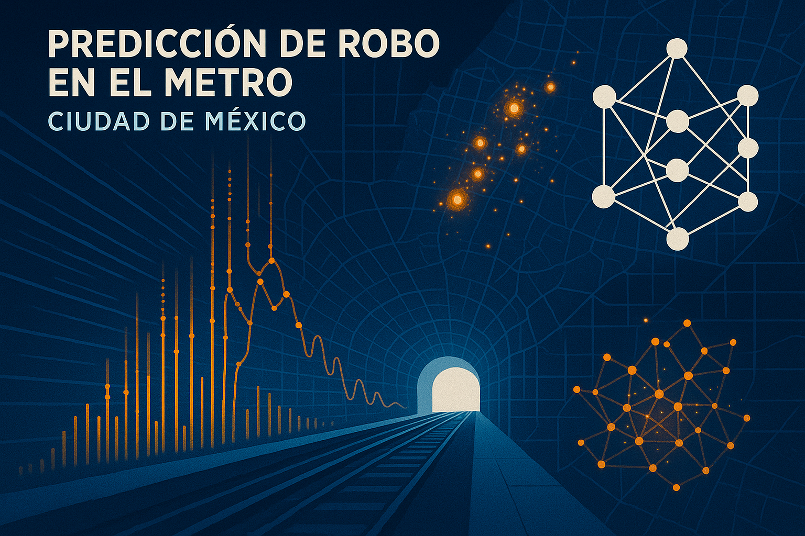
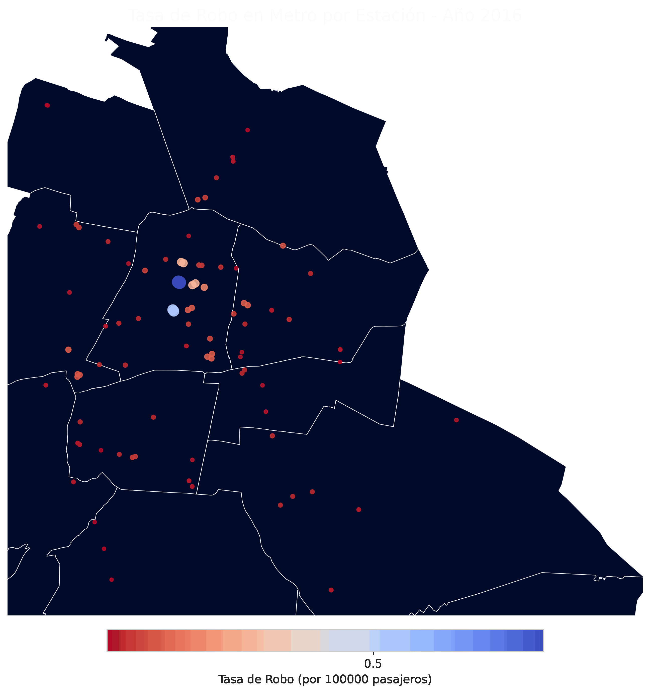
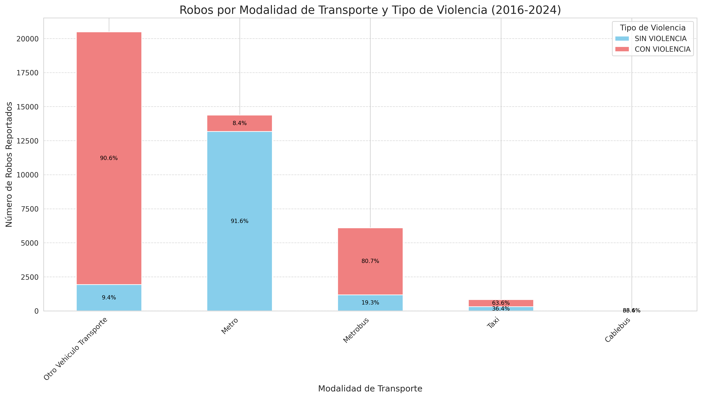
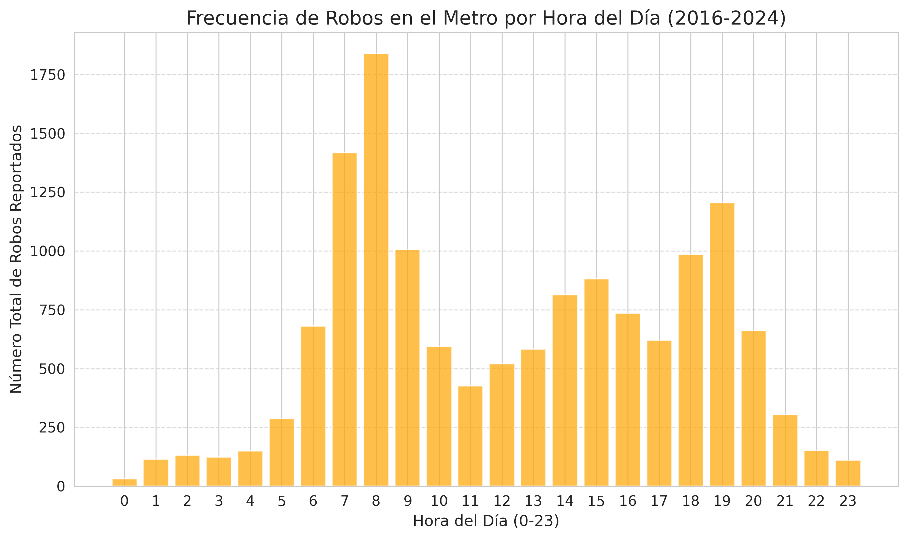
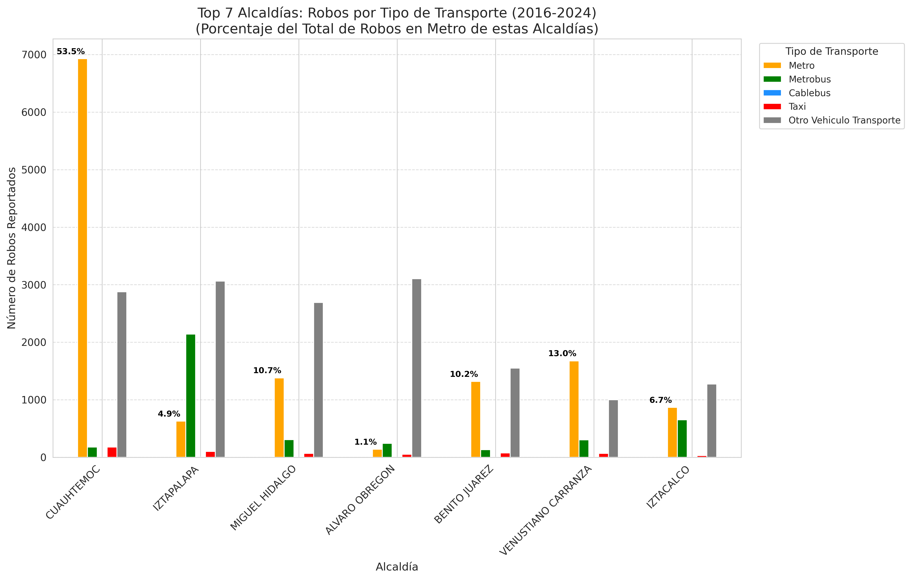
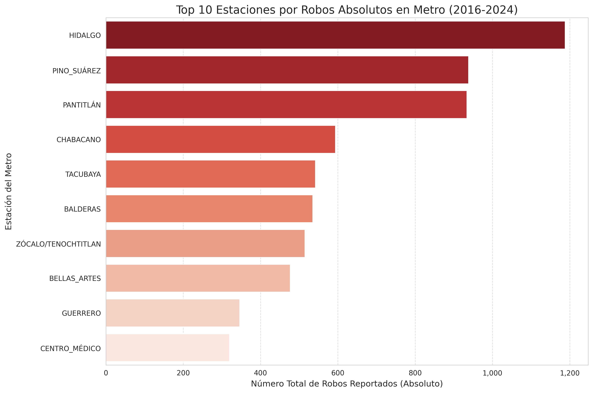
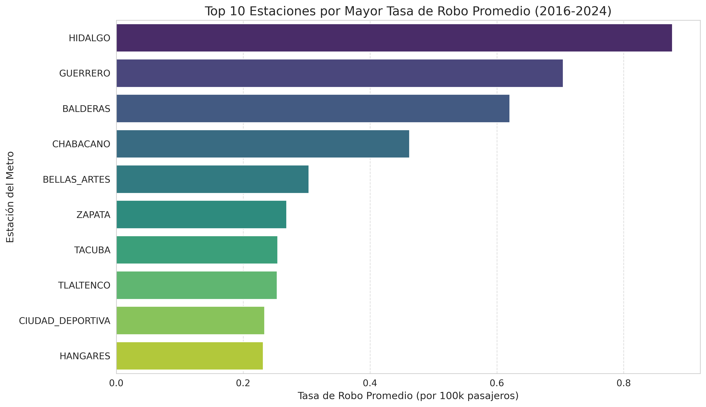
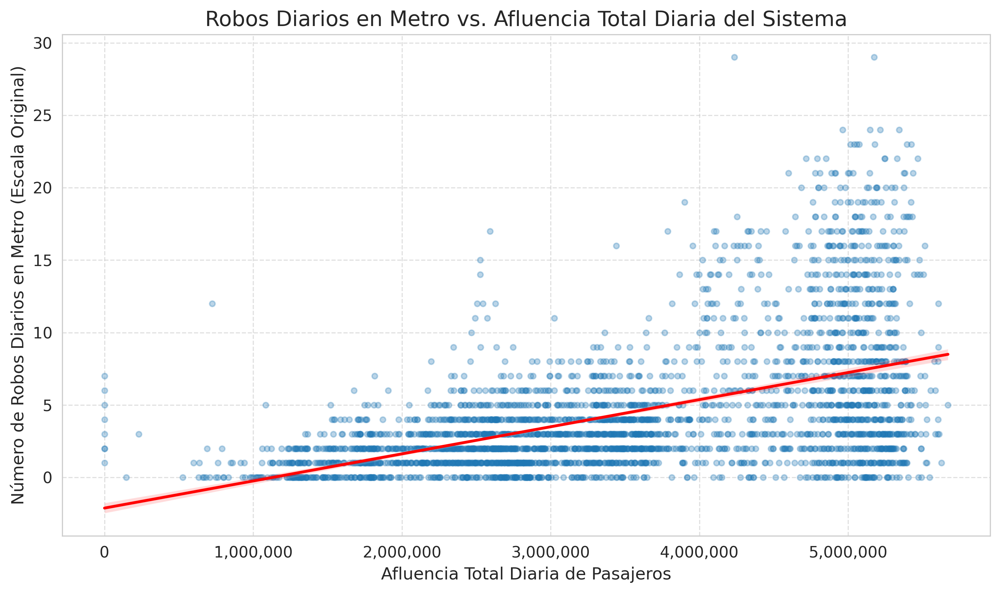
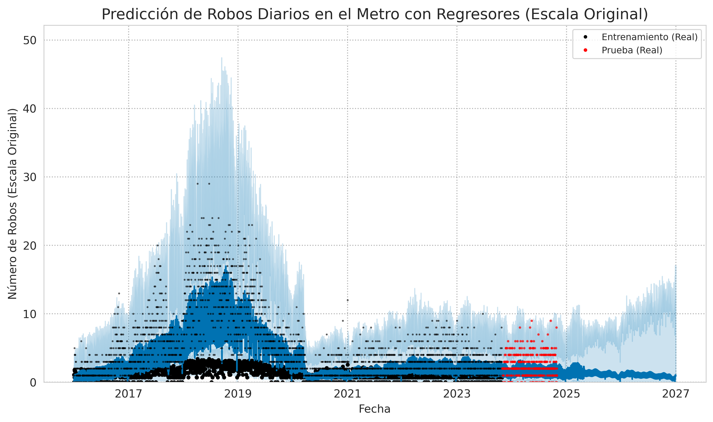

# El Crimen Bajo la Lupa: Desentrañando los Robos en el Metro CDMX con Ciencia de Datos

      

[Link presentación del Blog](https://gamma.app/docs/El-Crimen-Bajo-la-Lupa-q5hv1dlvmoq6qvt?mode=doc)
[Link Google Colab] (https://colab.research.google.com/drive/1-pMn6jTJ-cLo0dm_l7p4y00qUA1k9ItC?usp=drive_link)

> **Autores:** Arian Pedroza, Edgar Godinez, Miguel Cuellar
> **Afiliación:** Universidad Nacional Rosario Castellanos, Grupo 202, Ciencia de Datos para Negocios
> **Fecha:** 31 de mayo de 2025

<!-- Destacar el Paper PDF -->
Consulta el informe completo y detallado del proyecto aquí:

<!-- Opcional: Imagen de Portada/Banner -->

## Resumen del Proyecto

Este proyecto realiza un análisis exhaustivo del delito de robo en el Sistema de Transporte Colectivo (STC) Metro de la Ciudad de México, utilizando datos de carpetas de investigación de la FGJCDMX (2016-2024), datos de afluencia del Metro, información geográfica y socioeconómica. Aplicamos Análisis Exploratorio de Datos (EDA) para identificar patrones temporales y espaciales, modelado predictivo con Facebook Prophet (incluyendo regresores como afluencia y pandemia), y análisis de autocorrelación espacial (LISA) para explorar la relación entre robos a nivel alcaldía e indicadores socioeconómicos (Gini, IRS).

**Hallazgos Clave:**

*   **Patrones Temporales:** Picos de robo los viernes y en horas de alta afluencia (7-9 AM, 18-20 PM).
*   **Concentración Geográfica:** Mayor incidencia en alcaldías centrales, destacando Cuauhtémoc.
*   **Naturaleza del Delito:** La mayoría de los robos en Metro son sin violencia (91.5%).
*   **Modelado Predictivo:** El modelo Prophet logró predecir robos diarios con un Error Absoluto Medio (MAE) de ~1.31.
*   **Correlación Socioeconómica:** No se encontró una correlación global fuerte entre robos y los indicadores Coeficiente de Gini o Índice de Rezago Social (IRS) a nivel alcaldía.

**Propuestas Derivadas:**

*   Estrategias de patrullaje predictivo.
*   Rediseño ambiental basado en CPTED (Prevención del Delito Mediante el Diseño Ambiental).
*   Fortalecimiento de la transparencia y auditoría en la gestión.

## Visualizaciones Destacadas

<!-- Elige 1 o 2 de tus GIFs o gráficas más impactantes -->
**Evolución Anual de la Tasa de Robo por Pasajero por Estación (2016-2024):**

**Robos por Modalidad de Transporte y Tipo de Violencia (2016-2024):**

## Motivación

El STC Metro es vital para la CDMX, transportando aproximadamente **3.2 millones** de pasajeros diariamente. El robo en este sistema afecta la seguridad y confianza de millones. Este análisis busca proveer insights basados en datos para informar estrategias de prevención más efectivas.

## Fuentes de Datos Principales

*   **Carpetas de Investigación FGJCDMX:** (2016 - Oct 2024) - `carpetasFGJ_acumulado_2025_01.csv` del [Portal de Datos Abiertos CDMX](https://datos.cdmx.gob.mx/dataset/carpetas-de-investigacion-fgj-de-la-ciudad-de-mexico).
*   **Afluencia STC Metro:** (2010 - Abr 2025) - `Afluencia_metro-2025-05-18.csv` del [Portal de Datos Abiertos CDMX](https://datos.cdmx.gob.mx/dataset/afluencia-diaria-del-metro-cdmx).
*   **Geometrías Estaciones Metro:** `stcmetro_shp.zip` de SEMOVI / [Portal de Datos Abiertos CDMX](https://datos.cdmx.gob.mx/dataset/lineas-y-estaciones-del-stc-metro).
*   **Geometrías Alcaldías CDMX:** `poligonos_alcaldias_cdmx.zip` del [Portal de Datos Abiertos CDMX](https://datos.cdmx.gob.mx/dataset/alcaldias).
*   **Coeficiente de Gini (2020):** `GiniMunicipios2010_2015_2020.xlsx` de [CONEVAL](https://www.coneval.org.mx/Medicion/Paginas/Cohesion_Social.aspx).
*   **Índice de Rezago Social (2020):** `IRS_localidades_2020.xlsx` de [CONEVAL](https://www.coneval.org.mx/Medicion/Documents/IRS_2020/IRS_loc_2000_2020.zip) (agregado a nivel municipal).

## Metodología

1.  **Recopilación y Preprocesamiento de Datos:** Carga, limpieza, transformación de fechas, estandarización de ubicaciones, ingeniería de características (`tipo_violencia`, `transport_mode`, variables temporales).
2.  **Análisis Exploratorio de Datos (EDA):**
    *   Tendencias temporales generales (anuales, mensuales).
    *   Patrones detallados (hora, día de la semana) para el Metro.
    *   Distribución geográfica (alcaldías y estaciones - volumen y tasa de robo).
    *   Análisis de modalidad de violencia por tipo de transporte.
    *   Correlación robos vs. afluencia.
3.  **Modelado Predictivo (Facebook Prophet):**
    *   Modelado de serie de tiempo de robos diarios en Metro (con transformación logarítmica para estabilizar la varianza).
    *   Inclusión de regresores externos: afluencia diaria e indicador de pandemia COVID-19.
    *   Proceso estándar de entrenamiento, predicción y evaluación de métricas (MAE, RMSE, MAPE).
    *   Análisis de componentes del modelo (tendencia, estacionalidades anuales/semanales) y diagnóstico de residuos.
4.  **Análisis de Autocorrelación Espacial (Nivel Alcaldía, 2020):**
    *   Cálculo del Índice de Moran Global para evaluar la autocorrelación espacial general de los robos en Metro.
    *   Análisis de Indicadores Locales de Asociación Espacial (LISA) univariado para identificar clústeres de robos en Metro (utilizando contigüidad tipo Queen).
    *   Análisis LISA bivariado para explorar la relación espacial entre robos y el Coeficiente de Gini, y entre robos y el Índice de Rezago Social (IRS).

## Resultados Principales

*   **Patrones Temporales:** Pico de robos en Metro en 2018; caída en 2020 (pandemia) y recuperación parcial. Picos horarios a las 7-9 AM y 18-20 PM, y los días viernes.
    *   
*   **Violencia:** Mayoría de robos en Metro son sin violencia (91.5%), en contraste con otros transportes como "Otro Vehículo Transporte" (90.6% con violencia).
*   **Geografía del Delito:**
    *   Alcaldía Cuauhtémoc concentra la mayor parte de robos en Metro.
        *   
    *   Estaciones con más robos absolutos: Hidalgo, Pino Suárez, Pantitlán.
        *   
    *   Estaciones con mayor tasa de robo/afluencia (riesgo relativo): Hidalgo, Guerrero, Balderas.
        *   
*   **Afluencia:** Positivamente correlacionada con robos (r=0.513), explica ~26.3% de la varianza de robos diarios.
    *   
*   **Modelo Prophet:** El modelo predictivo alcanzó un Error Absoluto Medio (MAE) de ~1.31 robos diarios en el conjunto de prueba, capturando adecuadamente tendencias y estacionalidades.
    *   
*   **Análisis Socioeconómico Espacial (Alcaldía 2020):** No se encontró correlación global fuerte ni patrones LISA dominantes entre robos en Metro y Gini/IRS.

## Propuestas

1.  **Implementación de Estrategias de Patrullaje Predictivo y Adaptativo:** Utilizar los patrones temporoespaciales identificados y las predicciones del modelo para optimizar la asignación de recursos de seguridad en horarios y estaciones críticas.
2.  **Adopción de Medidas de Prevención del Delito Mediante el Diseño Ambiental (CPTED) en Estaciones Clave:** Rediseñar o mejorar elementos ambientales en estaciones de alto riesgo (ej. mejor iluminación, instalación de espejos convexos en puntos ciegos, reubicación de barreras o vallas) para disuadir la actividad delictiva.
3.  **Fortalecimiento de la Transparencia y los Mecanismos de Auditoría:** Promover una mayor rendición de cuentas en la gestión operativa y de seguridad del STC Metro, publicando datos relevantes y facilitando la supervisión ciudadana.

**Para más detalles sobre la metodología, resultados y propuestas, consulta el paper completo.**

## Estructura del Repositorio

*   `/paper/`: Contiene el reporte de investigación detallado en formato PDF.
*   `/notebooks/`: Jupyter Notebook (`EDA_Analisis_Robo_Metro.ipynb`) con todo el código del análisis.
*   `/data/raw/`: Datos originales utilizados.
*   `/data/processed/`: Datos intermedios generados (ej. `robos_asignados_a_estaciones_metro.csv`).
*   `/visualizations/`: Todas las gráficas, mapas y GIFs generados.

## Cómo Replicar el Análisis

1.  Clonar este repositorio.
2.  Asegurar tener Python 3.x y las librerías listadas en `requirements.txt`. Puedes instalarlas usando: `pip install -r requirements.txt`.
3.  Descargar los archivos de datos de las fuentes listadas y colocarlos en `data/raw/` (si no están ya en el repo).
4.  Ejecutar el notebook `notebooks/EDA_Analisis_Robo_Metro.ipynb`. Las visualizaciones se guardarán en `visualizations/`.

## Trabajo Futuro

*   Modelos predictivos más avanzados (LSTM, GNN, ST-Cokriging).
*   Análisis espacial a escala más fina (micro-hotspots).
*   Incorporación de más variables (eventos, clima).

## Contribuciones

¡Las contribuciones son bienvenidas! Si tienes ideas para mejorar este análisis, encuentras algún error, o quieres proponer nuevas funcionalidades o visualizaciones, por favor considera lo siguiente:

*   **Reporte de Errores (Issues):** Si encuentras un bug o un error en el análisis o en los datos, por favor abre un "Issue" en este repositorio detallando el problema.
*   **Sugerencias de Mejoras:** Para sugerencias sobre nuevas características o mejoras a las existentes, también puedes abrir un "Issue" describiendo tu propuesta.
*   **Pull Requests:** Si deseas contribuir directamente con código, correcciones o mejoras en la documentación, puedes hacer un "Fork" del repositorio y enviar un "Pull Request" con tus cambios. Por favor, asegúrate de que tu código siga un estilo consistente y esté bien comentado.

Agradecemos de antemano cualquier aporte para hacer este proyecto más robusto y útil.

## Contacto

Si tienes preguntas específicas sobre el proyecto o deseas discutir alguna colaboración, puedes ponerte en contacto con los autores (información de contacto pendiente de ser añadida por los autores).

Alternativamente, puedes abrir un "Issue" en este repositorio para preguntas técnicas o discusiones públicas sobre el análisis.

## Licencia

Este proyecto se comparte bajo la Licencia: MIT License.
